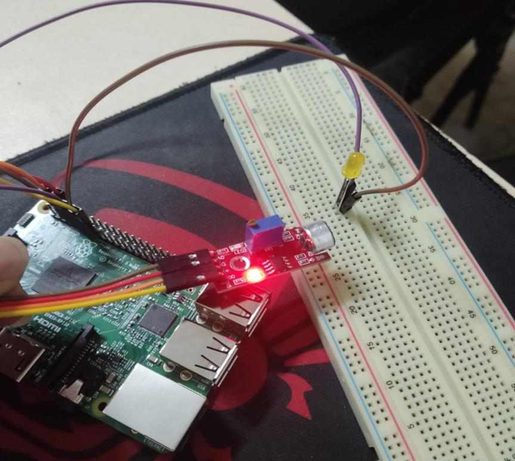

## Pendahuluan

Membuat kontrol Smart Home menggunakan sensor suara dan mikrokontroler raspberry pi 3.
Menggunakan MQTT broker untuk komunikasi data dan menyimpan data.
Membuat dan Menampilkan data menggunakan dashboard Grafana.
Membuat setiap komunikasi antara Sensor, Raspberry pi 3, EMQX, Node-RED, InfluxDB dan Grafana.

## Komponen

- Breadboard
- Raspberry Pi 4
- Sensor Suara
- Koneksi jaringan internet (WiFi)
- Led
- Kabel Jumper

## Rangkaian

Jika suara tidak terdeteksi maka LED tidak akan menyala

