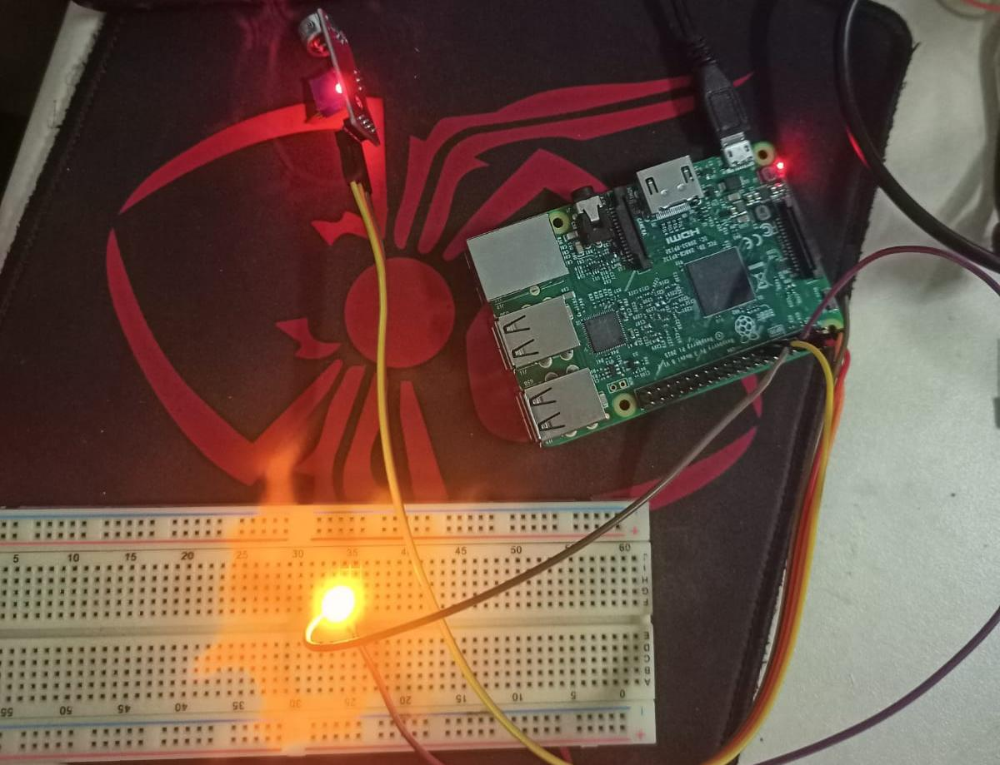
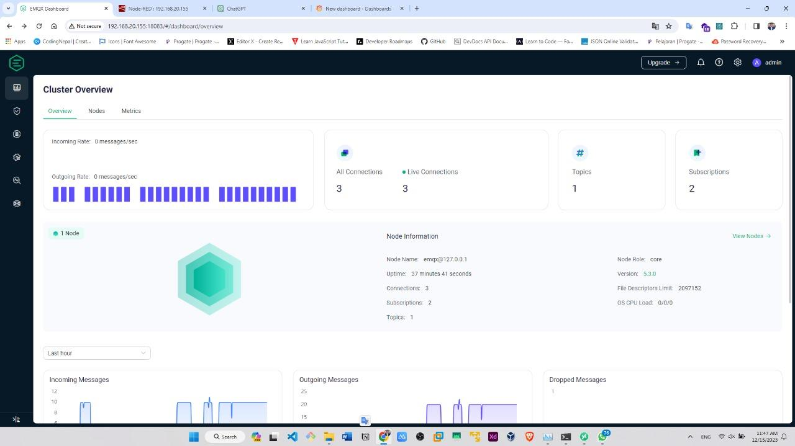
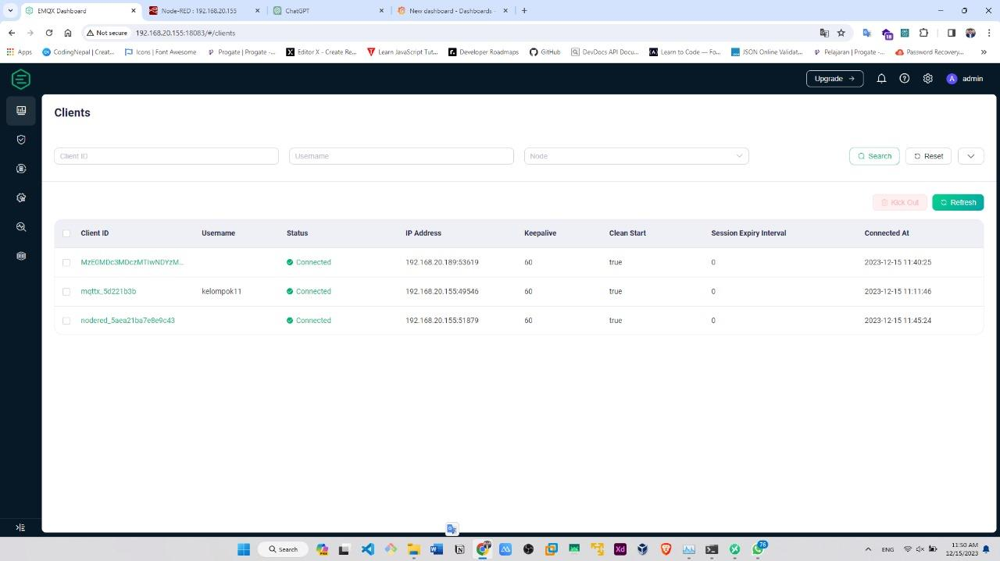
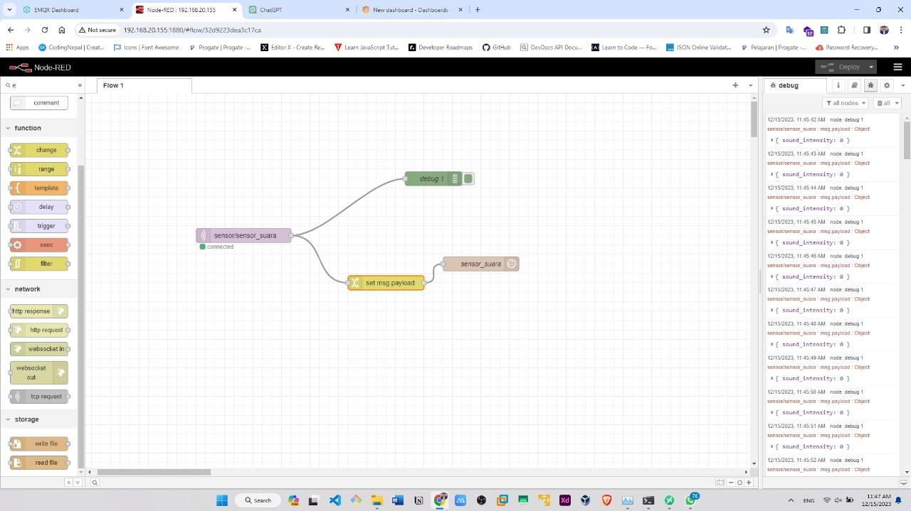
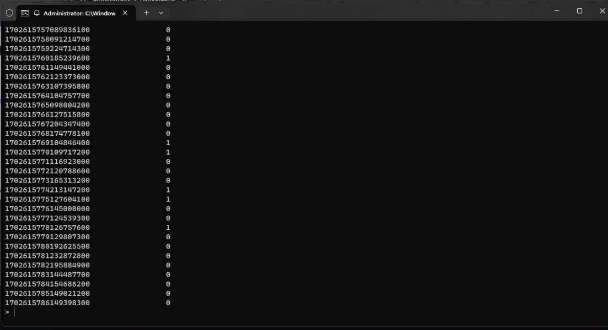
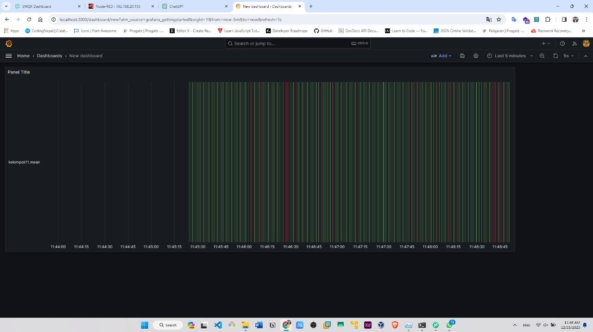

## Pendahuluan

Membuat kontrol Smart Home menggunakan sensor suara dan mikrokontroler raspberry pi 3.
Menggunakan MQTT broker untuk komunikasi data dan menyimpan data.
Membuat dan Menampilkan data menggunakan dashboard Grafana.
Membuat setiap komunikasi antara Sensor, Raspberry pi 3, EMQX, Node-RED, InfluxDB dan Grafana.

## Komponen

- Breadboard
- Raspberry Pi 4
- Sensor Suara
- Koneksi jaringan internet (WiFi)
- Led
- Kabel Jumper

## Rangkaian

Jika suara tidak terdeteksi maka LED tidak akan menyala

 

Jika suara terdeteksi maka LED akan menyala tid

## Komunikasi Terhadap EMQX

MQTT atau Message Queuing Telemetry Transport adalah suatu protokol komunikasi untuk mengirimkan data di antara perangkat. Dalam proyek otomatisasi lampu dengan memanfaatkan sensor suara, MQTT dapat dipakai untuk menghubungkan sensor suara, Raspberry Pi, dan mungkin perangkat lain yang turut serta dalam proyek tersebut. Apabila ada perubahan dalam tingkat kebisingan atau intensitas suara, sensor suara akan menghasilkan data dalam bentuk analog atau digital yang mencerminkan perubahan tersebut.

## Design Node-RED

Node-RED merupakan alat pemrograman visual yang dirancang untuk otomatisasi serta integrasi perangkat dengan bantuan antarmuka grafis yang sederhana untuk mengonfigurasi alur kerja. Pada proyek lampu otomatis dengan menggunakan sensor suara, Node-RED dapat digunakan untuk membuat alur kerja yang menggabungkan sensor suara, Raspberry Pi, dan kontrol output dengan mudah.

## InfluxDB

InfluxDB dapat digunakan sebagai basis data (database) untuk menyimpan dan menganalisis data dari sensor suara pada proyek lampu otomatis. InfluxDB biasanya digunakan untuk menyimpan data deret waktu (time series data), yang sesuai dengan karakteristik data yang dihasilkan oleh sensor suara yang mengukur intensitas suara seiring waktu.

Jika 1 maka dia terdeteksi, jika 0 maka dia tidak terdeteksi

## Grafana

Grafana adalah alat visualisasi data yang dapat diintegrasikan dengan basis data seperti InfluxDB untuk menyajikan data secara interaktif dan informatif.

Jika hijau artinya terdeteksi, jika merah artinya tidak terdeteksi

